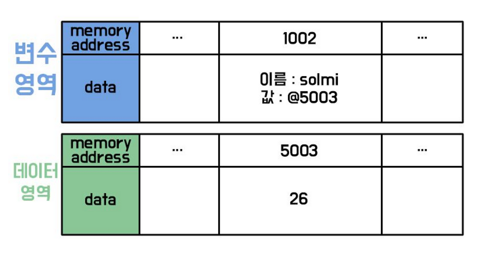
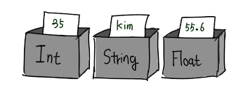
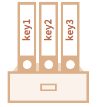
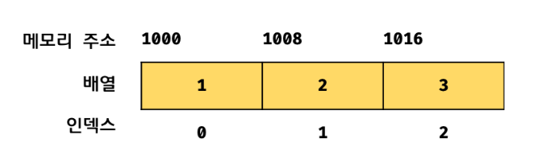
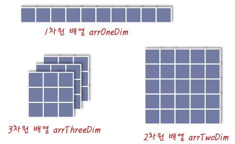

# 변수와 데이터 저장
## 변수란 무엇인가?
변수는 데이터를 저장하고 관리하기 위해 사용하는 **이름이 있는 저장 공간**입니다. 자바스크립트에서는 `var`, `let`, `const` 키워드를 사용하여 변수를 선언할 수 있습니다.

### 변수 선언과 할당
- **선언**: 변수를 생성하지만, 값이 없는 상태입니다.
- **할당**: 선언한 변수에 값을 저장합니다.



### 변수 선언 키워드
| 키워드  | 특징                                                                                      |
|---------|-------------------------------------------------------------------------------------------|
| `var`   | 함수 스코프를 가지며, 중복 선언이 가능합니다. (사용 자제 권장)                              |
| `let`   | 블록 스코프를 가지며, 재할당이 가능합니다.                                                |
| `const` | 블록 스코프를 가지며, 재할당이 불가능합니다. 상수 값이나 객체를 저장하는 데 주로 사용됩니다. |

### 변수 선언의 예
```js
let name = "Alice"; // let으로 선언한 변수
const age = 25;    // const로 선언한 변수
```

----

# 자료형과 메모리 구조
## 자료형이란 무엇인가?
자료형은 프로그램이 데이터를 **메모리에 저장하고 관리**하기 위한 체계다. 각 데이터는 특정 자료형에 따라 메모리에 저장되며, 자바스크립트에서는 크게 **원시 자료형**과 **객체 자료형**으로 나뉜다.




### 원시 자료형 (Primitive Data Types)
원시 자료형(Primitive Data Type)은 프로그래밍 언어에서 가장 기본적인 데이터 유형으로, 더 이상 나눌 수 없는 단일 값을 가진다.
| 자료형     | 설명                          | 예시                           |
|------------|-------------------------------|--------------------------------|
| Number     | 숫자 데이터                   | 10, 3.14, -25                  |
| String     | 문자열 데이터                 | 'Hello', "World"              |
| Boolean    | 논리 데이터 (참/거짓)        | true, false                    |
| Null       | 값이 없음을 나타냄           | null                           |
| Undefined  | 변수가 선언되었으나 값이 없음 | let a; → a === undefined       |

# 객체 자료형과 메모리
## 객체 자료형이란?
객체 자료형은 **키-값 쌍(Key-Value Pair)**으로 데이터를 저장하는 구조다. 객체는 **데이터를 구조적으로 관리**하기 위해 설계된 자료형이며, 메모리의 **힙(heap)** 영역에 데이터를 저장하고 참조(reference)를 통해 이를 관리한다.


### 객체 자료형
- **객체(Object)**: 키-값 쌍으로 데이터를 저장.

    

- **배열(Array)**: 순서가 있는 데이터의 집합.

    
- **다차원 배열** : 다차원 배열은 여러 차원의 데이터를 저장하는 구조로, 주로 행과 열로 구성된다.
    
    

- **함수(Function)**: 실행 가능한 코드 블록.

    


### 메모리 관리
- 객체 자료형은 **참조(reference)** 방식으로 동작한다.
- 변수를 복사할 경우, 객체 자체가 아닌 **메모리 주소를 복사**하여 동일한 데이터를 참조한다.


#### 예제: 참조에 의한 메모리 관리
```js
let original = { name: "Alice", age: 25 };
let copy = original; // 메모리 주소를 복사
copy.name = "Bob";

console.log(original.name); // 출력: Bob (original도 영향을 받음)
```

------ 

# 자료형 변환
## 1. 동적 타입
자바스크립트는 **동적 타입** 언어이다. 변수에 저장된 값에 따라 자료형이 자동으로 할당된다.
즉, 동적 타입 언어는 변수 선언이 아닌 할당에 의해 타입이 결정(타입 추론)되며
재할당에 의해 변수의 타입은 언제든지 동적으로 변할 수 있다.<br>
예를 들어, 숫자를 저장했던 변수에 문자열을 저장하면 자료형이 숫자에서 문자열로 변경된다.<br>
이것은 개발자의 의도와 상관 없이 자바스크립트 엔진에 의해 암묵적으로 타입이 자동 변환되는 것으로
유연성은 높지만 신뢰성은 떨어진다.<br>
이로 인해 변수를 사용하기 전 데이터 타입 체크를 하기도 하는데 이는 번거롭기도 하고 코드의 양도 증가한다.
변수의 값이 언제든지 변경 될 수 있기 때문에 값을 확인하기 전에는 타입을 확신할 수 없다.<br> 

```js
let test; 
// test 변수를 선언하였으나 값을 설정하지 않았으므로 빈 값을 의미하는 undefined 타입이 됨

test = 1; 
// 이전 시점에 test 변수는 undefined였으나, 이제 숫자 1이 할당됨으로써 test의 타입은 Number로 변경됨

test = "1"; // "" <- 문자열을 의미하며 "", '' 감싸진 값은 문자열로 취급이 된다.
// 이제 test 변수에 문자열 "1"가 할당됨으로써, test의 타입은 String으로 변경됨

test = true; 
// test 변수에 Boolean 값 true가 할당되면서, test의 타입은 Boolean으로 변경됨

test = null; 
// test 변수에 null이 할당되면서, test의 타입은 다시 null로 변경됨

test = { name: "Alice" }; 
// test 변수에 객체가 할당되면서, test의 타입은 Object로 변경됨

test = [1, 2, 3]; 
// test 변수에 배열이 할당되면서, test의 타입은 Array(객체의 한 종류)로 변경됨

```


## 2. 암묵적 변환 (묵시적 형변환)
자바스크립트는 연산이나 비교 과정에서 자료형을 자동으로 변환한다.

### 2-1. 문자열과 숫자의 연산
숫자와 문자열을 더하면 숫자가 문자열로 변환된다.

```js
// 연산자는 이후에 배운다.
console.log(10 + "20"); // 출력: "1020" (숫자가 문자열로 변환되어 연결)
console.log("10" * 2); // 출력: 20 ("10"이 숫자로 변환되어 계산)
```

### 2-2. 불리언 변환
- false로 변환되는 값: 0, "", null, undefined, NaN.
- 나머지 값은 true로 변환된다.

```js
console.log(Boolean(0)); // 출력: false
console.log(Boolean("Hello")); // 출력: true
console.log(Boolean("")); // 출력: false
```

## 3. 명시적 변환
명시적 변환은 개발자가 의도적으로 자료형을 변경하는 것을 의미한다.

### 3-1. 숫자로 변환
Number()를 사용하여 문자열이나 불리언을 숫자로 변환한다.

```js
console.log(Number("42")); // 출력: 42
console.log(Number("Hello")); // 출력: NaN
console.log(Number(true)); // 출력: 1
console.log(Number(false)); // 출력: 0
```

### 3-2. 문자열로 변환
String()을 사용하여 숫자나 불리언을 문자열로 변환한다.

```js
console.log(String(42)); // 출력: "42"
console.log(String(true)); // 출력: "true"
```

### 3-3. 불리언으로 변환
Boolean()을 사용하여 값을 불리언으로 변환한다.

```js
console.log(Boolean(1)); // 출력: true
console.log(Boolean(0)); // 출력: false
console.log(Boolean("")); // 출력: false
```

