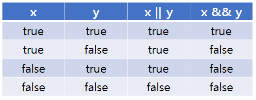

# 연산자와 표현식
## 자바스크립트 연산자
자바스크립트에서 연산자는 값을 조작하고 계산하는 데 사용된다.  
이를 통해 덧셈, 뺄셈, 곱셈, 나눗셈, 나머지 연산을 수행하며, 증가와 감소 연산자로 값을 쉽게 조작할 수 있다. 

### 1. 산술 연산자 (Arithmetic Operators)
산술 연산자는 숫자 값을 계산하는 데 사용된된다.

| 연산자 | 설명                        | 예시          |
|--------|----------------------------|---------------|
| `+`    | 덧셈                       | `5 + 3` → `8` |
| `-`    | 뺄셈                      | `5 - 3` → `2` |
| `*`    | 곱셈                       | `5 * 3` → `15`|
| `/`    | 나눗셈                     | `6 / 3` → `2` |
| `%`    | 나머지                     | `5 % 2` → `1` |
| `**`   | 거듭제곱                  | `2 ** 3` → `8`|

### 2. 대입 연산자 
대입 연산자는 변수에 값을 할당하는 데 사용된다.

| 연산자 | 설명                          | 예시                |
|--------|-------------------------------|---------------------|
| `=`    | 단순 대입                    | `a = 5`             |
| `+=`   | 덧셈 후 대입                 | `a += 3` → `a = a + 3` |
| `-=`   | 뺄셈 후 대입                 | `a -= 2` → `a = a - 2` |
| `*=`   | 곱셈 후 대입                 | `a *= 4` → `a = a * 4` |
| `/=`   | 나눗셈 후 대입               | `a /= 2` → `a = a / 2` |
| `%=`   | 나머지 후 대입               | `a %= 3` → `a = a % 3` |
| `**=`  | 거듭제곱 후 대입            | `a **= 2` → `a = a ** 2` |

### 2. 비교 연산자 (Comparison Operators)
비교 연산자는 두 값을 비교하고, 결과를 불리언 값(`true` 또는 `false`)으로 반환한다.

| 연산자 | 설명                        | 예시            |
|--------|----------------------------|-----------------|
| `==`   | 값이 같은지 비교           | `5 == '5'` → `true` |
| `===`  | 값과 타입이 같은지 비교    | `5 === '5'` → `false` |
| `!=`   | 값이 같지 않은지 비교      | `5 != '5'` → `false` |
| `!==`  | 값과 타입이 같지 않은지 비교| `5 !== '5'` → `true` |
| `>`    | 왼쪽 값이 오른쪽 값보다 큰지 비교 | `5 > 3` → `true` |
| `>=`   | 왼쪽 값이 오른쪽 값보다 크거나 같은지 비교 | `5 >= 5` → `true` |
| `<`    | 왼쪽 값이 오른쪽 값보다 작은지 비교 | `3 < 5` → `true` |
| `<=`   | 왼쪽 값이 오른쪽 값보다 작거나 같은지 비교 | `3 <= 3` → `true` |

### 3. 논리 연산자 (Logical Operators)
논리 연산자는 불리언 값을 조합하거나 반전하는 데 사용된다.

| 연산자 | 설명                        | 예시            |
|--------|----------------------------|-----------------|
| `&&`   | AND 연산 (둘 다 true일 때 true) | `true && false` → `false` |
| `||`   | OR 연산 (하나라도 true일 때 true) | `true || false` → `true` |
| `!`    | NOT 연산 (값을 반전)       | `!true` → `false` |

#### 결론
자바스크립트의 연산자는 다양한 방식으로 데이터를 처리하고 비교하는 데 필수적이다. 각 연산자의 기능을 잘 이해하면 더 복잡한 로직을 작성하는 데 도움이 된다.

----

## 비교 연산자

### 동등성 비교
비교 연산자는 값의 크기나 일치 여부를 확인할 때 사용한다. 프로그래밍에서 조건 판별은 코드의 흐름을 제어하는 데 필수적이다. 

컴퓨터 메모리에서 데이터는 값과 타입으로 저장된다. 자바스크립트의 비교 연산자는 메모리에 저장된 값을 비교할 때, 타입을 고려하거나 무시할 수 있다. 이를 통해 유연하게 조건을 처리하거나 엄격하게 검증할 수 있다.

#### `==`와 `===`의 차이

- **`==`(동등 연산자)**:
  - 값만 비교하며, 필요시 타입을 암묵적으로 변환하여 비교한다.
  - 예: 문자열 `"10"`과 숫자 `10`은 동등(`true`)하다.
  
- **`===`(일치 연산자)**:
  - 값과 타입을 모두 비교한다.
  - 예: 문자열 `"10"`과 숫자 `10`은 타입이 다르므로 일치하지 않는다(`false`).

#### `!=`와 `!==`의 차이

- **`!=`(부등 연산자)**:
  - 값만 비교하며, 필요시 타입을 암묵적으로 변환한다.
  
- **`!==`(불일치 연산자)**:
  - 값과 타입을 모두 비교한다.

### 크기 비교 연산자

크기 비교 연산자는 숫자, 문자열, 그리고 사전순 비교에 사용된다. 메모리 상에서 숫자는 정렬 가능한 값으로 저장되며, 문자열은 사전순으로 비교된다.

#### 연산자 종류

- `<`: 작다
- `>`: 크다
- `<=`: 작거나 같다
- `>=`: 크거나 같다

---------

## 논리 연산자

### 기본 논리 연산
논리 연산자는 조건을 결합하거나 반전시키는 데 사용한다. 프로그래밍에서 조건문의 흐름을 제어하기 위해 필수적인 도구다.

#### **논리 연산자 종류와 동작**

- **`&&` (AND)**: 
  - 두 조건이 모두 `true`일 때만 `true`를 반환한다.
  - 조건 중 하나라도 `false`이면 `false`를 반환한다.
  
- **`||` (OR)**: 
  - 조건 중 하나라도 `true`이면 `true`를 반환한다.
  - 모두 `false`일 때만 `false`를 반환한다.
  
- **`!` (NOT)**: 
  - 조건을 반전시킨다. `true`는 `false`로, `false`는 `true`로 변환한다.

---

## 단축 평가

단축 평가는 조건의 평가를 최소화하여 효율성을 높이는 기법이다.

### **동작 방식**
- **`||` (OR)**:
  - 첫 번째 조건이 `true`라면 두 번째 조건은 평가하지 않는다. 기본값 설정에 자주 사용된다.
  - 예: `value || defaultValue`는 `value`가 `true`일 경우 `value`를 반환하고, `false`일 경우 `defaultValue`를 반환한다.
  
- **`&&` (AND)**:
  - 첫 번째 조건이 `false`라면 두 번째 조건은 평가하지 않는다.
  - 예: `value && otherValue`는 `value`가 `true`일 때만 `otherValue`를 평가한다.

- **`??` (Nullish Coalescing)**:
  - `null` 또는 `undefined`인 경우 기본값을 설정한다.
  - 예: `value ?? defaultValue`는 `value`가 `null` 또는 `undefined`일 때만 `defaultValue`를 반환한다.

---
## 삼항 연산자

### 개념
삼항 연산자는 조건에 따라 값을 반환하는 간단한 연산자다. 조건문을 짧게 표현할 수 있어 가독성과 효율성을 높일 수 있다.

#### **표현식**
`조건 ? 참일 때 값 : 거짓일 때 값`

- 조건이 `true`라면 `?` 뒤의 값을 반환한다.
- 조건이 `false`라면 `:` 뒤의 값을 반환한다.

#### **특징**
1. 메모리 효율: 삼항 연산자는 단일 표현식으로 동작하여 조건문에 비해 적은 메모리를 사용할 수 있다.
2. 가독성: 간단한 조건에서는 코드의 길이를 줄이고 가독성을 높인다.
3. 제한된 사용: 조건이 복잡하거나 여러 로직이 포함될 경우 가독성이 떨어질 수 있다.