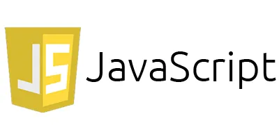

# 자바스크립트란?

## **자바스크립트란 무엇인가?**

자바스크립트(JavaScript)는 **인터프리터형 프로그래밍 언어**로, 주로 **웹 개발**에서 사용된다. HTML과 CSS가 정적인 웹 페이지를 구성하는 역할을 한다면, 자바스크립트는 웹 페이지에 **동적 기능**을 추가한다.

- **인터프리터형 언어**: 실행 시점에 코드를 한 줄씩 해석하고 실행한다. (반면, 컴파일러 언어는 실행 전에 전체 코드를 번역하여 실행한다.)
- **객체 기반(Object-Based) 언어**: 객체의 개념을 지원하지만 순수 객체지향 언어(C++ 또는 Java)와는 다르게 클래스 없이 객체를 생성할 수 있다.
- **멀티 패러다임**: 명령형, 함수형, 객체지향 프로그래밍 스타일을 지원한다.

### **주요 특징**
1. **클라이언트 사이드 언어**: 웹 브라우저에서 실행되어 사용자와 상호작용한다.
2. **비동기 처리**: 콜백 함수, 프라미스(Promise), async/await를 이용해 동기적/비동기적 처리를 할 수 있다.
3. **이식성**: 브라우저에 종속되지 않으며 다양한 플랫폼(예: Node.js)에서 사용 가능하다.
4. **동적 타입 언어**: 변수 선언 시 자료형이 고정되지 않는다. (예: `var x = 10;` → `x`는 숫자지만 후에 문자열로 변경될 수 있다.)
5. **표준화**: ECMA International에 의해 ECMAScript(ES) 표준으로 관리된다.

## **웹 개발에서의 역할**

웹 개발은 주로 **HTML, CSS, 자바스크립트**로 구성된다. 

| 언어         | 역할                                         | 설명                                       |
|--------------|---------------------------------------------|--------------------------------------------|
| **HTML**    | 구조(Structure)                              | 웹 페이지의 기본 뼈대를 구성한다.          |
| **CSS**     | 스타일(Style)                                | 레이아웃과 시각적 디자인을 담당한다.       |
| **JavaScript** | 동작(Behavior) 및 인터랙티브 기능         | 사용자와 상호작용할 수 있도록 기능을 추가한다.|

## **자바스크립트의 역사와 발전 과정**

### **초기 역사**
- **1995년**: 넷스케이프(Netscape)의 브랜든 아이크(Brendan Eich)가 자바스크립트를 개발했다. 처음에는 "Mocha"라는 이름으로 시작되었으며, 후에 "LiveScript"로 변경되었다.
- **자바와의 관계**: 자바스크립트는 자바와 문법적으로 유사하지만 전혀 다른 언어다. 당시 자바의 인기에 편승하기 위해 "JavaScript"라는 이름이 붙여졌다.

### **ECMAScript의 등장**
- **1997년**: ECMA International이 **ECMAScript** 표준을 발표하였다.
- **ECMAScript**는 자바스크립트의 언어 사양이며, 다양한 구현체(브라우저 엔진)들이 이를 기반으로 한다.

### **주요 버전 발전**
1. **ES3 (1999)**: 초기 표준화 버전, 대부분의 브라우저가 지원.
2. **ES5 (2009)**: JSON 지원, `strict mode` 도입.
3. **ES6/ES2015 (2015)**: 모던 자바스크립트의 시작.  
   - `let`/`const`, 화살표 함수, 클래스, 모듈 시스템 도입.
4. **ES7+ (2016~)**: 매년 새로운 기능 추가.  
   - 비동기 처리 `async/await`, 프라미스(Promise) 등 추가.

## **브라우저와 자바스크립트 엔진**

자바스크립트는 **브라우저의 자바스크립트 엔진**을 통해 실행된다. 각 브라우저는 독자적인 엔진을 가지고 있으며, 엔진은 ECMAScript 표준을 구현한다.

### **주요 자바스크립트 엔진**
| 브라우저       | 자바스크립트 엔진   | 특징                                |
|---------------|-------------------|------------------------------------|
| Chrome       | **V8**            | Google이 개발한 오픈소스 엔진. Node.js 기반. |
| Firefox      | **SpiderMonkey**  | 최초의 자바스크립트 엔진.          |
| Safari       | **JavaScriptCore** | Apple의 WebKit 엔진 기반.          |
| Edge         | **Chakra** (구)   | 현재는 V8 엔진으로 전환됨.         |

### **자바스크립트 엔진의 동작 원리**
1. **파싱 (Parsing)**: 코드를 토큰화하고 **AST (Abstract Syntax Tree)**로 변환한다.
2. **인터프리팅 (Interpreting)**: AST를 바탕으로 코드를 해석하고 실행한다.
3. **JIT 컴파일 (Just-In-Time Compilation)**: 실행 속도 최적화를 위해 핫스팟 코드(자주 실행되는 코드)를 즉시 컴파일한다.

### **V8 엔진의 특성**
- **고성능**: JIT 컴파일러를 통해 빠른 실행 속도를 제공한다.
- **Node.js**: V8 엔진을 기반으로 서버 사이드에서도 자바스크립트를 실행할 수 있다.
- **Garbage Collection (GC)**: 메모리 관리 및 최적화를 수행한다.

## 환경 설정
- [자바스크립트 설치](https://nodejs.org/ko) : 다음 링크는 node.js를 설치하는 경로를 제공한다.  
node.js는 자바스크립트를 로컬에서 설치할 수 있도록 제공하는 프로그램이다.

- [vscode](https://code.visualstudio.com/) : 다음 경로는 vscode를 설치하는 경로이다. 
우리가 프로그램 언어를 실행하기 위해서는 IDE라는 프로그램 언어를 작성하기 위한 메모장과 같은 프로그램이 필요하다.  
이러한 IDE는 우리가 프로그램 개발을 하는데 있어 많은 편리함을 제공한다는 특징을 갖는다.

위 두개의 프로그램을 다운로드한다.

## **결론**

자바스크립트는 웹 개발의 핵심 언어로 자리 잡고 있으며, 클라이언트와 서버 양쪽에서 활용된다. ECMAScript 표준에 기반하여 지속적으로 발전하고 있으며, 브라우저 엔진의 성능 향상과 함께 빠르고 효율적인 웹 애플리케이션 개발을 가능하게 한다.